# Claude 3.7 Token Limits in Cursor

This document explains how token limits for Claude 3.7 models are handled in Cursor, where the relevant code is located, and how to modify these limits if needed.

## Token Limit Implementation Overview

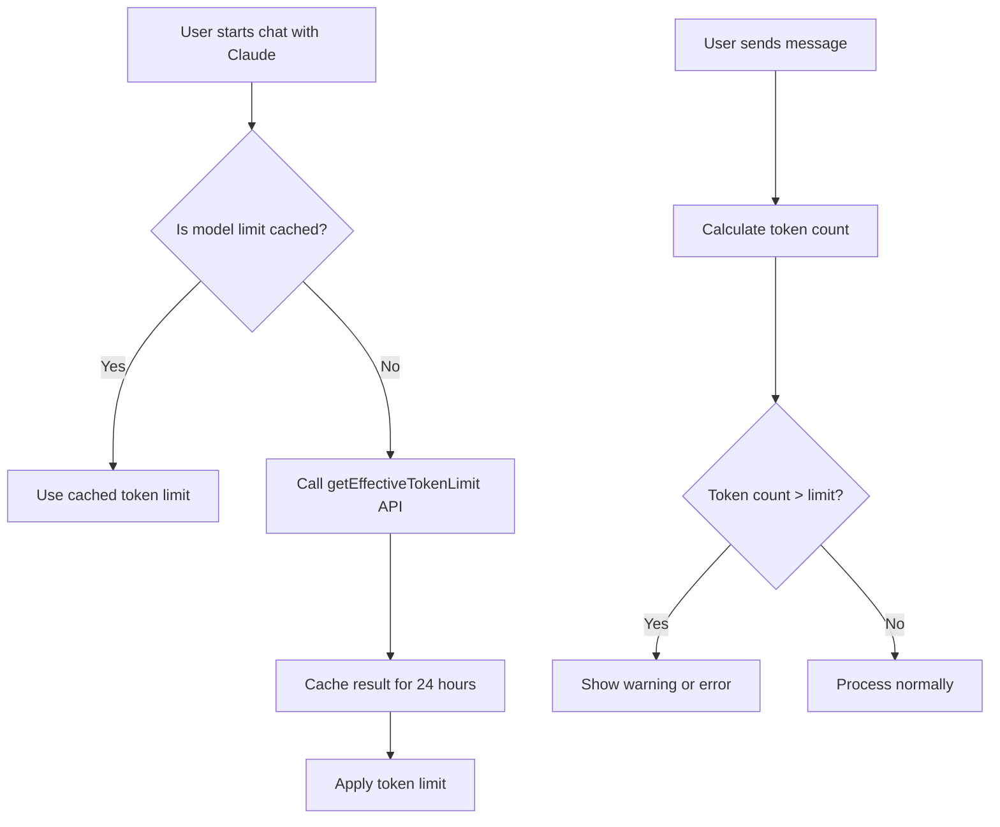

## Key Files and Locations

### Main Files

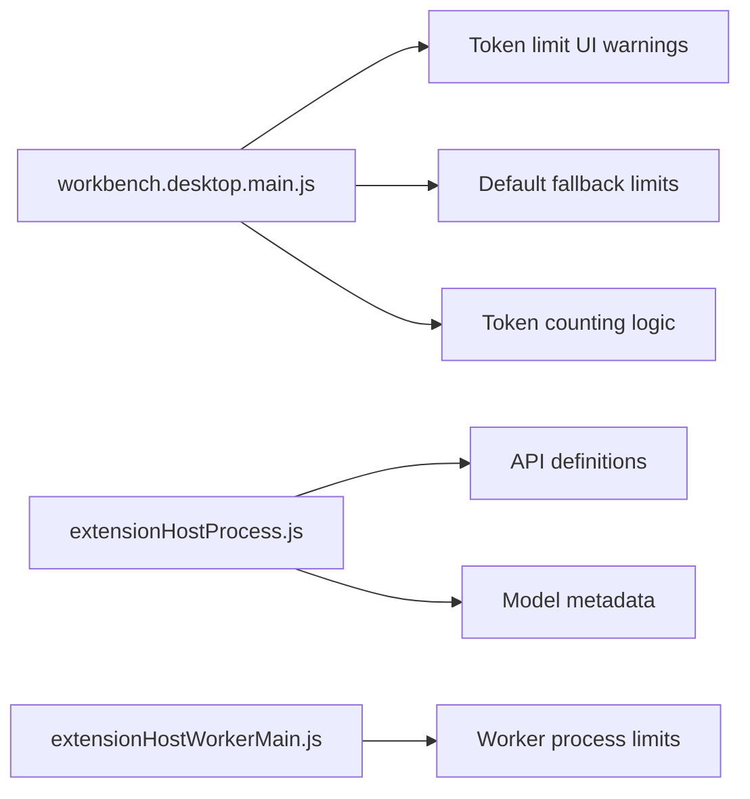

### Critical Code Sections

1. **Default Token Limit**: 
   - **File**: `resources/app/out/vs/workbench/workbench.desktop.main.js` (line ~2586)
   - **Description**: Sets default context token limit to 30,000 tokens

2. **Token Limit API**: 
   - **File**: `resources/app/out/vs/workbench/workbench.desktop.main.js` (line ~612)
   - **Description**: Contains the `getEffectiveTokenLimit` function

3. **Claude Model Definitions**: 
   - **File**: `resources/app/out/vs/workbench/workbench.desktop.main.js` (line ~2587-2589)
   - **Description**: Contains references to Claude 3.7 models and variants

4. **Model Response Handlers**:
   - **File**: `resources/app/out/vs/workbench/api/node/extensionHostProcess.js` (line ~139)
   - **Description**: Handles model metadata including token limits

## Claude 3.7 Regular vs. Max: Context Window Differences

The code analysis reveals that the primary difference between regular Claude 3.7 Sonnet and the "Max" variants is the context window size. This is intentionally configured in the application:

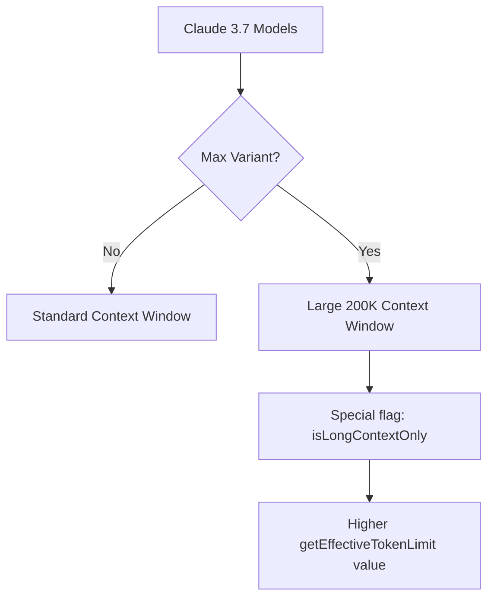

### Key Evidence from Codebase

1. **Model Configuration Flags**:
   - The code at `resources/app/out/vs/workbench/workbench.desktop.main.js` (~line 572) shows other Claude models with 200K context using the `isLongContextOnly` flag:
   ```javascript
   {name:"claude-3-5-sonnet-200k", defaultOn:!0, isLongContextOnly:!0, supportsAgent:!0}
   ```

2. **Context Window Access Control**:
   - In `workbench.desktop.main.js` (~line 74), there's a reference to `longContextOpenAIModel:"claude-3-5-sonnet-200k"`, showing that some Claude models are specifically flagged for long context

3. **Token Limit Resolution Flow**:
   - The `getEffectiveTokenLimit` function (line ~612) determines the token limit for a model by:
     1. Checking a cache first
     2. If not cached, calling the server API
     3. Falling back to 200,000 tokens if the API fails
   - This system allows for dynamic configuration of token limits for different models without hardcoding them

4. **No Hard-Coded Distinction**:
   - There's no explicit code setting different token limits for `claude-3.7-sonnet` vs. `claude-3.7-sonnet-max` in the client
   - Instead, the `getEffectiveTokenLimit` API call retrieves these limits from the server

### How the "Max" Variants Get Higher Limits

Based on the codebase patterns, when the app calls `getEffectiveTokenLimit` for a "Max" variant:

1. The server recognizes the model as premium
2. The server returns a higher token limit value (likely 200K)
3. The client stores this value in cache for 24 hours
4. All subsequent token limit checks use this cached higher value

The regular Claude 3.7 variant follows the same pattern but receives a lower token limit from the server.

### Server-Side Control

The actual token limit values are determined server-side, not in the client code. This allows Cursor to:

1. Update token limits without client changes
2. Configure different limits for different user tiers
3. Apply model-specific restrictions
4. Handle API-level token limit enforcement

## How to Modify Claude 3.7 Max Limits

To give regular Claude 3.7 access to the same 200K context window as the Max variant, you would need to:

1. **Server-side change (ideal)**: Modify the server API to return the same token limit for regular Claude 3.7 as it does for the Max variant

2. **Client-side hack**:
   ```javascript
   // Find the getEffectiveTokenLimit function in workbench.desktop.main.js (~line 612)
   async getEffectiveTokenLimit(e) {
     const n = e.modelName;
     // Add this condition to override for Claude 3.7
     if (n === "claude-3.7-sonnet") {
       return 200000; // Same limit as Max
     }
     // Rest of the original function...
   }
   ```

3. **Cache manipulation**: Another approach would be to manipulate the client-side token limit cache to always return the Max limit value for the regular variant.

## Modifying Token Limits

### Option 1: Override Default Fallback Limit

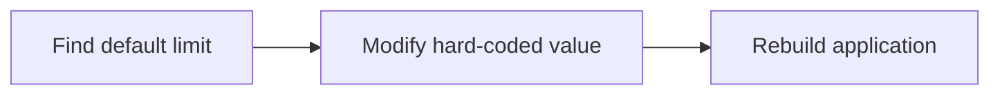

To increase the default fallback limit (used when the server doesn't provide a specific value):

1. Locate the line in `workbench.desktop.main.js` where the default limit is set (~line 2586)
2. Change `3e4` (30,000) to your desired value
3. Rebuild the application

### Option 2: Modify Server Response

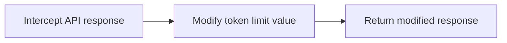

If you have access to the server implementation:

1. Find the server-side implementation of `getEffectiveTokenLimit`
2. Adjust the returned token limit for Claude 3.7 models
3. Deploy the server changes

### Option 3: Client-Side Cache Override

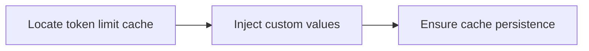

To override the client-side cache:

1. Find the token limit cache storage in `workbench.desktop.main.js` (~line 612)
2. Modify how the application stores or retrieves these values
3. Ensure your changes persist across application restarts

## Claude 3.7 Model Variants

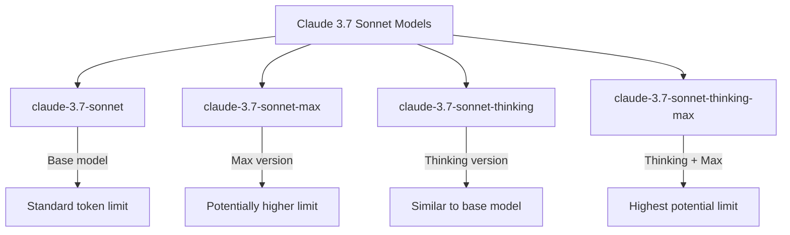

## Differences Between Claude 3.7 Variants

Based on code analysis from the Cursor codebase, here are the key differences between Claude 3.7 variants:

### 1. Standard vs. Max Versions

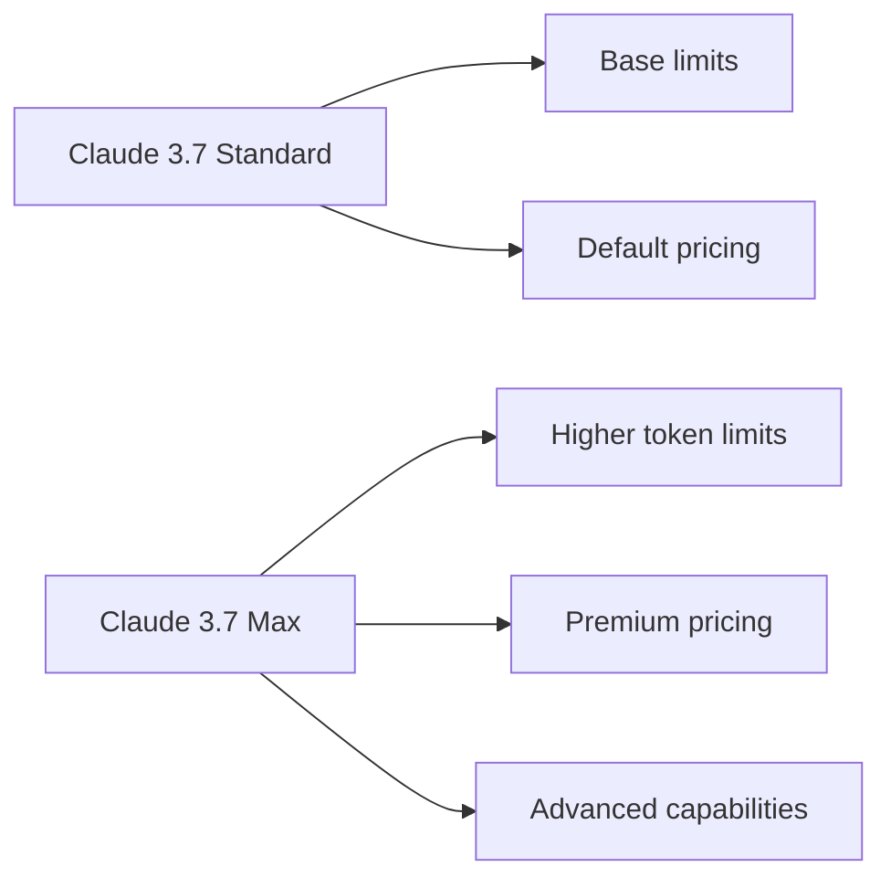

The codebase reveals:

- **Max vs. Standard**: The code at `workbench.desktop.main.js` (~line 2587-2589) shows "Max" variants have special UI treatments with gradient styling, suggesting premium status
- **Visual Indicators**: Max models use a `"continuous-gradient-container gradient-high"` CSS class for visual distinction
- **Different Default Usage**: The background composer model defaults to "claude-3.7-sonnet-thinking-max" (~line 572), suggesting this is considered the most capable variant

### 2. Regular vs. Thinking Modes

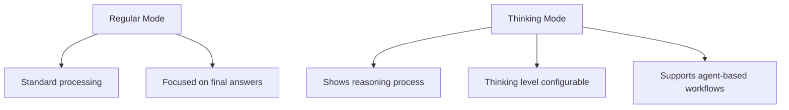

From the codebase:

- **Thinking Level Configuration**: `getModeThinkingLevel` function (~line 592) indicates thinking modes can be configured with different levels: "none", "medium", or "high"
- **Thinking Time Tracking**: The app tracks and displays thinking time metrics (~line 2295)
- **UI for Thinking**: There's dedicated UI for thinking states: "Planning next moves" vs. "Thought for X seconds" vs. "Stopped thinking"
- **Thinking Mode Toggle**: Code (~line 2788) shows direct mode conversion between regular and thinking modes:
  ```javascript
  function Ut(qt){
    return qt==="claude-3.7-sonnet"?"claude-3.7-sonnet-thinking":
           qt==="claude-3.7-sonnet-max"?"claude-3.7-sonnet-thinking-max":
           null
  }
  ```

### 3. Configuration and Agent Support

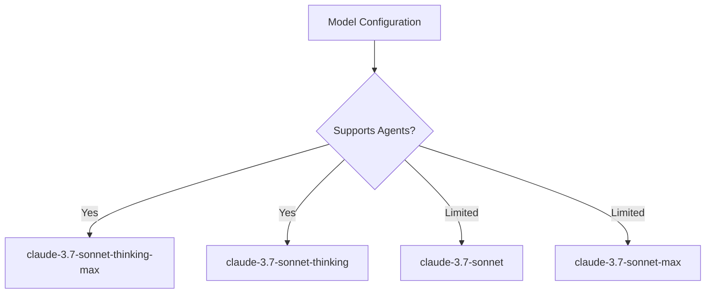

Key findings:

- **Agent Support**: The `doesModelSupportAgent` function (~line 2007) is used to check if a model supports agent capabilities
- **Tool Use**: The code suggests that thinking variants may have better integration with tools and agents
- **Background Processing**: Max variants, especially "claude-3.7-sonnet-thinking-max", are used for background processing, indicating they may have better performance for complex tasks

### 4. Default Selection Logic

The code at `workbench.desktop.main.js` (~line 2587) shows how model defaults are managed:

```javascript
c7s = (i, e, t, s, n) => {
  if (i)
    if (e)
      if (i === "claude-3.7-sonnet") 
        t("claude-3.7-sonnet-thinking");
      else if (i === "claude-3.7-sonnet-max") 
        t("claude-3.7-sonnet-thinking-max");
      // ... other models
    else if (i === "claude-3.7-sonnet-thinking") 
      t("claude-3.7-sonnet");
    else if (i === "claude-3.7-sonnet-thinking-max") 
      t("claude-3.7-sonnet-max");
    // ... other logic
}
```

This logic shows the close relationship between standard and thinking variants, with easy toggling between them.

## Warning and Error Handling

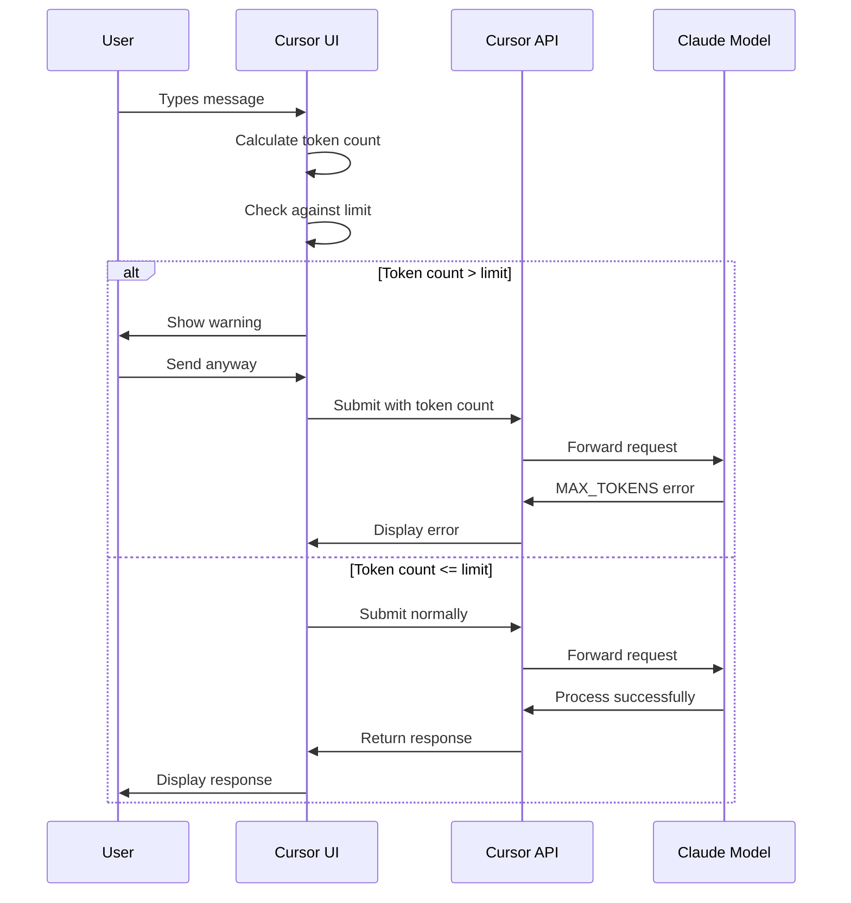

## Token Costs and Pricing

While the exact pricing isn't hardcoded in the client code, there are indications of cost differences:

1. **Thinking Modes Cost Tracking**: The code tracks both `processedTokens` and `thinkingTokens` separately, along with their associated costs (`processedCost` and `thinkingCost`)

2. **Max Variants Premium Status**: The UI treatment of Max variants (with gradient styling) suggests they are premium offerings

3. **API Key Requirements**: There are references to Claude API keys, suggesting some models may require specific authentication or be available at different pricing tiers

## Technical Implementation Notes

- Token limits are dynamically fetched from the server to allow for updates without client changes
- The client caches these limits for 24 hours (864e5 milliseconds)
- If the server request fails, a default of 200,000 tokens is used
- The UI displays warnings when approaching the token limit
- The system includes specific handling for MAX_TOKENS errors
- Each model variant may have different token limits

## Claude 3.7 API Integration and Tool Usage

Based on analysis of the codebase, here's how Cursor integrates with Claude 3.7 APIs and implements tool usage:

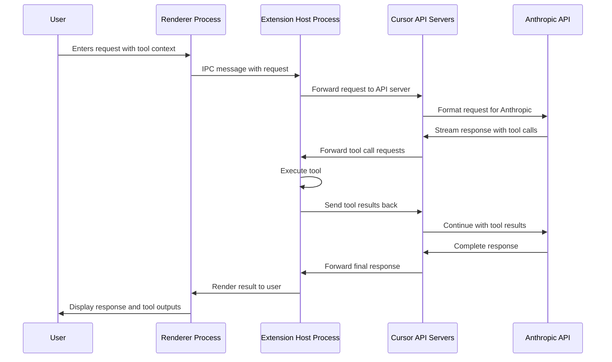

### API Endpoints and Communication

1. **Server Endpoints**:
   - Primary API endpoints: `https://api2.cursor.sh`, `https://api3.cursor.sh`, and `https://api4.cursor.sh`
   - These servers act as proxies to Anthropic's API at `https://api.anthropic.com/v1/messages`
   
2. **Process Communication**:
   - Cursor uses a multi-process architecture based on Electron
   - Inter-Process Communication (IPC) connects the Renderer process and Extension Host process
   - The Extension Host handles direct communication with Claude via API servers

### Tool Integration Framework

1. **Tool Definition System**:
   - Tools are defined using the VSCode API extension interface
   - Each tool has a schema, name, and invoke function
   - Defined in `vscode.d.ts` with interfaces like `LanguageModelTool` and `LanguageModelToolCallPart`

2. **Tool Call Processing**:
   - When Claude makes a tool call, it returns a `LanguageModelToolCallPart` in the response stream
   - The Extension Host process executes the tool using `invokeTool`
   - Results are returned as `LanguageModelToolResultPart` objects
   - Tool execution can be synchronous or asynchronous

3. **Tool Types Available**:
   - **File System Tools**: Reading, writing, and navigating files
   - **Search Tools**: Code search, file search, and grep functionality
   - **Terminal Command Tools**: Executing shell commands
   - **Web Search Tools**: External web search integration

### Claude Request Structure

Cursor formats requests to Claude using the Anthropic API format:

```javascript
{
  messages: [
    { role: "user", content: [{ type: "text", text: userMessage }] },
    // Previous messages in conversation
  ],
  model: "claude-3.7-sonnet", // Or variant
  max_tokens: tokenLimit, // From getEffectiveTokenLimit
  system: systemPrompt, // Contains Cursor-specific instructions
  tools: [
    // Tool definitions based on available tools
    {
      name: "toolName",
      description: "Tool description",
      input_schema: { /* JSON schema */ },
    }
  ]
}
```

### Error Handling and Retry Logic

1. **Token Limit Errors**:
   - Code includes specific handling for `CLAUDE_IMAGE_TOO_LARGE` (error code 31)
   - MAX_TOKENS errors trigger UI warnings and suggestions

2. **API Communication Errors**:
   - Connection failures are handled with retry logic
   - Error codes are mapped to user-friendly messages
   - Custom fallbacks for common failure scenarios

### Personal API Key Integration

1. **Key Management**:
   - Users can provide their own Anthropic API keys through the `useClaudeKey` setting
   - Keys are stored securely using the application storage service
   - Sample API key usage appears in code snippets for both PowerShell and curl

2. **Key-based Features**:
   - When a personal key is used, different error handling may apply
   - Premium features may be available based on the user's Anthropic account tier

This comprehensive analysis shows how Cursor integrates Claude 3.7 models using a sophisticated multi-process architecture, with detailed tool support and robust error handling capabilities. 