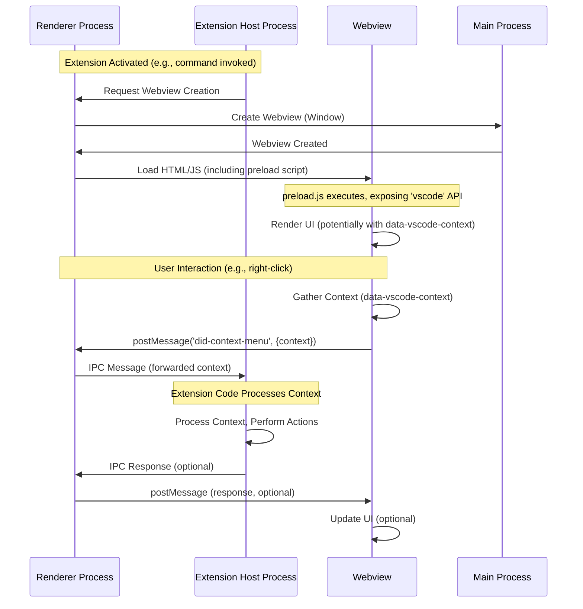
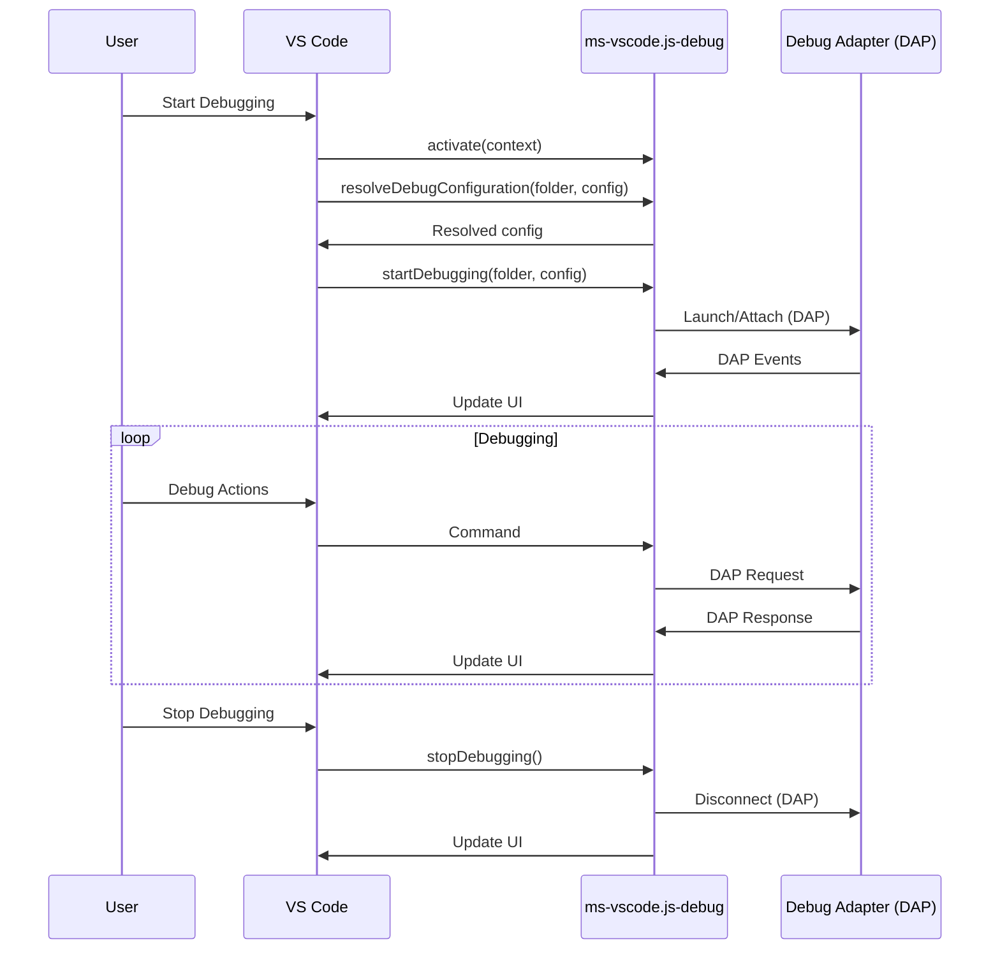
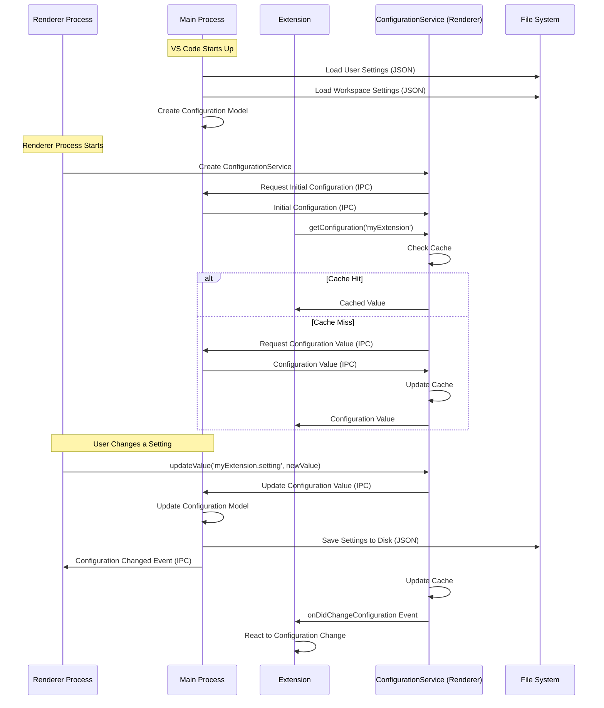

# Cursor IDE Codebase Context and Data Flow

This document provides a granular analysis of the Cursor IDE codebase, focusing on component interactions, data flow, and specifically how contextual information is managed and passed between different parts of the system. We'll use Mermaid diagrams to illustrate these relationships.

## 1. High-Level Component Interaction

As established in the main documentation, Cursor uses a multi-process architecture based on Electron. Here's a refined view of the core component interactions:

```mermaid
graph LR
    subgraph Main_Process [Main Process]
        A[Application Lifecycle]
        B[Window Management]
        C[Global Settings]
        D[IPC Handler]
    end

    subgraph Renderer_Processes [Renderer Processes]
        E[Core Editor]
        F[UI Rendering]
        G[Command Execution]
        H[Webviews]
        I[IPC Client]
    end

    subgraph Extension_Host_Processes [Extension Host Processes]
        J[Extension Manager]
        K[Extension Execution]
        L[IPC Client/Server]
    end

    subgraph Shared_Process [Shared Process]
        M[Shared Tasks]
        N[IPC Handler]
    end

    subgraph Worker_Processes [Worker Processes]
        O[Background Tasks]
    end
    
    subgraph Pty_Host [Pty Host]
        P[Terminal]
    end

    subgraph File_Watcher [File Watcher]
        Q[File System Monitoring]
    end

    Main_Process -- IPC --> Renderer_Processes
    Main_Process -- IPC --> Extension_Host_Processes
    Main_Process -- IPC --> Shared_Process
    Main_Process -- IPC --> Worker_Processes
    Main_Process -- IPC --> Pty_Host
    Main_Process -- IPC --> File_Watcher

    Renderer_Processes -- IPC --> Extension_Host_Processes
    Renderer_Processes -- postMessage --> H
    H -- postMessage --> Renderer_Processes
    Extension_Host_Processes -- IPC --> Renderer_Processes
    Extension_Host_Processes -- IPC/Function Calls --> Worker_Processes

    Shared_Process -- IPC --> Renderer_Processes
    Shared_Process -- IPC --> Extension_Host_Processes

    File_Watcher -- IPC --> Main_Process
    File_Watcher -- IPC --> Renderer_Processes
    Pty_Host -- IPC --> Renderer_Processes

    style Main_Process fill:#ccf,stroke:#333,stroke-width:2px
    style Renderer_Processes fill:#fcf,stroke:#333,stroke-width:2px
    style Extension_Host_Processes fill:#cff,stroke:#333,stroke-width:2px
    style Shared_Process fill:#fcc,stroke:#333,stroke-width:2px
    style Worker_Processes fill:#ffc,stroke:#333,stroke-width:2px
    style Pty_Host fill:#ccf,stroke:#333,stroke-width:2px
    style File_Watcher fill:#fcf,stroke:#333,stroke-width:2px

```



**Key Observations:**

*   **Central Role of IPC:** Inter-Process Communication (IPC) is the backbone of communication between all major processes.
*   **Webview Isolation:** Webviews communicate with the renderer process (and indirectly with the extension host) via `postMessage`, maintaining a security boundary.
*   **Extension Host Isolation:** Extensions run in separate processes, communicating via IPC with the renderer and potentially worker processes.

## 2. Context Passing Mechanisms

Cursor, like VS Code, relies on several mechanisms to manage and pass context:

*   **IPC (Electron's `ipcMain` and `ipcRenderer`):**  The primary mechanism for structured data exchange between processes. Preload scripts (`preload.js`, `preload-aux.js`) establish secure channels for this communication.  This is likely a *major* component of any "MCP".
*   **Webview `postMessage`:**  Webviews use `postMessage` to send data to the extension host (via the renderer process) and receive data using `onmessage` event listeners. This is used for custom UI elements and is *another key candidate* for context passing.
*   **VS Code API (Extension Context):**  Extensions receive a context object (`vscode.ExtensionContext`) during activation. This context provides access to:
    *   `globalState`:  A key-value store for persisting data across sessions (globally).
    *   `workspaceState`: A key-value store for persisting data within the current workspace.
    *   `subscriptions`:  A mechanism for managing disposables (like event listeners) to prevent memory leaks.
    *   `extensionUri`:  The URI of the extension's directory.
    *   `storageUri`:  A URI for the extension's local storage.
    *   `globalStorageUri`: A URI for the extension's global storage.
    *   `environmentVariableCollection`: For managing environment variables.
    *   `secrets`: For storing secrets.
*   **Command Contexts:**  VS Code commands can receive context information when they are executed. This context can include information about the active editor, selected text, and other relevant data. This is often passed as arguments to command handlers.
*   **`data-vscode-context` Attribute (Webviews):** As seen in `index-no-csp.html` and `index.html`, HTML elements within webviews can have a `data-vscode-context` attribute. This attribute stores a JSON object containing contextual information.  This is *highly likely* to be part of the "MCP," as it's a direct way to embed context within the UI.
* **Drag and Drop Context:** The drag and drop events in `index.html` also show context being passed.

## 3. Deep Dive: `preload.js` and `preload-aux.js`

These files are critical for understanding how context is *initially* passed to renderer processes. They establish the secure IPC channels.

**`preload-aux.js` (Simplified and Annotated):**

```javascript
// Requires Electron modules.  This is safe in the preload script.
const { ipcRenderer, webFrame, contextBridge } = require("electron");

// ... (Error handling and utility functions) ...

// Expose a limited API to the renderer process via `window.vscode`.
contextBridge.exposeInMainWorld("vscode", {
  // ... (Other exposed functions) ...

  // Wrapped IPC send.  Enforces "vscode:" prefix for security.
  ipcRenderer: {
    send: (channel, ...args) => {
      if (!channel.startsWith("vscode:")) {
        console.error(`Invalid IPC channel: ${channel}`);
        return;
      }
      ipcRenderer.send(channel, ...args);
    },
    invoke: async (channel, ...args) => {
      if (!channel.startsWith("vscode:")) {
        console.error(`Invalid IPC channel: ${channel}`);
        return;
      }
      return ipcRenderer.invoke(channel, ...args);
    },
  },

  // ... (Other exposed functions) ...
});
```

**`preload.js` (Conceptual Similarities):**

The main `preload.js` follows a similar pattern, but for the primary renderer process. It also exposes a `vscode` object with wrapped IPC functions.

**Key Takeaway:** The `vscode:` prefix enforced on IPC channels is a crucial security measure, but it also acts as a *namespace* for context-related messages. Any message sent through these channels could potentially carry contextual information.

## 4. Webview Context: `data-vscode-context`

The `data-vscode-context` attribute is a direct way to embed context within webview UI elements. Let's revisit the relevant snippet from `index.html` (and `index-no-csp.html`):

```html
<!-- ... (Inside the 'contextmenu' event listener) ... -->

<script>
  // ... (Inside the 'contextmenu' event listener) ...
  let context = {};
  let el = e.target;
  while (el) {
    el = el.closest('[data-vscode-context]');
    if (!el) {
      break;
    }
    try {
      context = { ...JSON.parse(el.dataset.vscodeContext), ...context };
    } catch (e) {
      console.error(`Error parsing 'data-vscode-context' as json`, el, e);
    }
    el = el.parentElement;
  }

  hostMessaging.postMessage('did-context-menu', {
    clientX: e.clientX,
    clientY: e.clientY,
    context: context // The accumulated context is sent!
  });
</script>
```

**Key Observations:**

*   **Context Accumulation:** The code searches up the DOM tree for `data-vscode-context` attributes, merging them into a single `context` object. This allows for hierarchical context, where more specific elements can override or extend the context of their parents.
*   **JSON Serialization:** The context is stored as a JSON string, which is a standard way to represent structured data.
*   **Message Passing:** The accumulated context is sent to the extension host via `hostMessaging.postMessage`. This is how the context from the UI becomes available to the extension's code.

## 5. Hypothesized "MCP" Flow (Focusing on Webviews)

Based on the above analysis, here's a likely flow for how context is managed, particularly in scenarios involving webviews:



**Explanation:**

1.  **Extension Activation:** An extension is activated (e.g., by a user command or an event).
2.  **Webview Creation:** The extension requests the creation of a webview.
3.  **Preload Script:** The webview's preload script (`preload.js` or `preload-aux.js`) executes, exposing a limited API (`window.vscode`) to the webview's JavaScript code.
4.  **UI Rendering:** The webview renders its UI.  Elements within the UI *may* have `data-vscode-context` attributes containing contextual information.
5.  **User Interaction:** The user interacts with the webview (e.g., right-clicks on an element).
6.  **Context Gathering:** The webview's JavaScript code gathers the relevant context, potentially by traversing the DOM and collecting `data-vscode-context` attributes.
7.  **Message Passing:** The webview sends a message (using `postMessage`) to the renderer process, including the gathered context.
8.  **IPC Forwarding:** The renderer process forwards the message (and the context) to the extension host via IPC.
9.  **Context Processing:** The extension host's code processes the context and performs the appropriate actions.
10. **Response (Optional):** The extension host may send a response back to the webview (via IPC and `postMessage`), which can then update the UI.

## 6.  Locating "MCP" Handling:  Where to Look

While we haven't found a file explicitly named "MCP," the above analysis points to several key areas where the *logic* of context management and passing resides:

*   **Preload Scripts (`preload.js`, `preload-aux.js`):**  These define the secure IPC channels and are the *first point of contact* for context passing to renderer processes.
*   **Webview HTML/JS Files (e.g., `index.html`, `index-no-csp.html`, `audioPreview.js`, `imagePreview.js`):**  These files handle user interactions within webviews and gather context using `data-vscode-context` and other mechanisms.
*   **Extension Code (within `extensions/*`):**  Extensions receive context through the VS Code API (e.g., `ExtensionContext`, command arguments) and process messages from webviews.  The `cursor-*` extensions are particularly relevant for AI-related context.
*   **IPC Handlers (in Main, Renderer, and Extension Host processes):**  Any code that handles IPC messages (using `ipcMain.on`, `ipcRenderer.on`, `ipcRenderer.send`, `ipcRenderer.invoke`) is potentially involved in context passing.
* **VS Code API usage:** Any usage of the VS Code API related to state management (globalState, workspaceState) is relevant.

To find the most relevant code, you should:

1.  **Search for `data-vscode-context`:**  This is a strong indicator of context being embedded in the UI.
2.  **Search for `postMessage` and `onmessage`:**  These are used for webview communication.
3.  **Search for `ipcRenderer.send`, `ipcRenderer.invoke`, `ipcMain.on`, `ipcRenderer.on`:** These are used for IPC.
4.  **Examine the `cursor-*` extensions:** These are likely to be heavily involved in AI-related context management.
5.  **Look for uses of `globalState` and `workspaceState`:** These are used for persisting context.
6.  **Examine command definitions and handlers:** Commands often receive context as arguments.

By focusing on these areas and tracing the flow of data, you can gain a comprehensive understanding of how Cursor manages and passes context, effectively uncovering the implementation of its "Model Context Protocol," even if it's not explicitly named as such. 

## 7. `ms-vscode.js-debug` Extension Analysis

(Analysis of `package.json` and `src/extension.js`)

**Debugger Context Flow:**



## 8. Core Configuration Service Analysis

(Analysis of core configuration files and how they use IPC)

**Configuration Loading and Updating Flow (Hypothesized):**



## 9. Product Configuration Analysis

Analysis of `product.json` reveals important configuration details about how Cursor manages its servers and extensions:

**Server Configuration:**
*   **Server Components:**
    *   `serverApplicationName`: "cursor-server"
    *   `serverDataFolderName`: ".cursor-server"
    *   `tunnelApplicationName`: "cursor-tunnel"
    *   `serverDownloadUrlTemplate`: "https://cursor.blob.core.windows.net/remote-releases/${commit}/vscode-reh-${os}-${arch}.tar.gz"

*   **Marketplace Configuration:**
    *   `extensionsGallery.serviceUrl`: "https://marketplace.cursorapi.com/_apis/public/gallery"
    *   `extensionsGallery.itemUrl`: "https://marketplace.cursorapi.com/items"

*   **Application Paths:**
    *   `dataFolderName`: ".cursor" (This is where user-specific data and configurations are likely stored)
    *   `applicationName`: "cursor"

*   **Extension Management:**
    *   Skips packaging of certain local extensions:
        *   "cursor-experiments"
        *   "cursor-context-ast-typescript"
        *   "cursor-browser"
        *   "cursor-pyright"
    *   These extensions might contain development or experimental features

**Implications for MCP Configuration:**

1.  **Data Location:** The `.cursor` folder (specified by `dataFolderName`) is likely where MCP-related configurations are stored locally.

2.  **Server Architecture:**
    *   The presence of both `cursor-server` and `cursor-tunnel` suggests a sophisticated server architecture
    *   This might explain the "supa3" and "context" servers - they could be different instances or roles of the `cursor-server`

3.  **Extension Handling:**
    *   The `cursor-context-ast-typescript` extension being in `skipPackagingLocalExtensions` suggests it might be part of the MCP system
    *   This extension likely handles TypeScript/JavaScript context analysis

**Next Steps:**

1.  **Examine Local Data:**
    *   Look in the `.cursor` directory for configuration files
    *   Check the `.cursor-server` directory for server-specific settings

2.  **Investigate Extensions:**
    *   Analyze the `cursor-context-ast-typescript` extension
    *   Look for connections between the skipped extensions and MCP functionality

3.  **Server Investigation:**
    *   Examine how `cursor-server` and `cursor-tunnel` are configured
    *   Look for configuration files that might specify "supa3" and "context" server details 